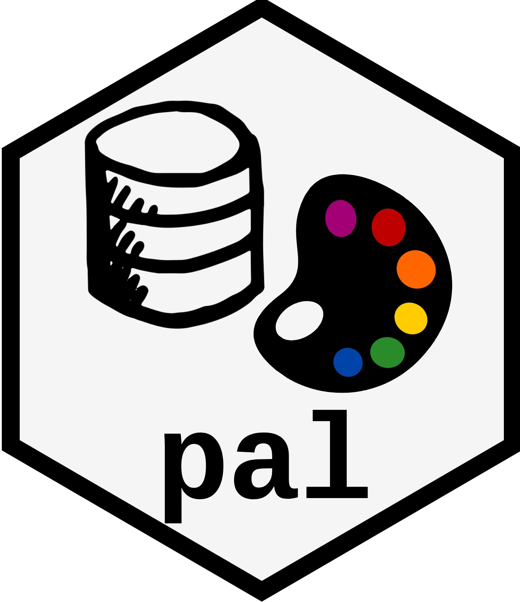

<!-- README.md is generated from README.Rmd. Please edit that file -->
pal 
===============================================================

[pal](https://github.com/csaybar/pal) is a color palette search engine that will find your ideal color palette by making [cpt-city](http://soliton.vm.bytemark.co.uk/pub/cpt-city/index.html), [hex-color](https://www.color-hex.com/color-palettes/), and [paletteer](https://github.com/EmilHvitfeldt/paletteer) more accessible to realize queries. There are more than 80 000 &gt; palettes waiting to be used!.

Installation
------------

``` r
#You can install the released version of pal:
install.packages("pal")

#or the development version from Github:
#instal.packages("devtools")
devtools::install_github('csaybar/pal')
```

Usage
-----

`pal` has been designed to be the most intuitive as possible. You can access to any color palette using `pal_search` and `pal_get`.

`pal_search` initializes a S3 object that stores the databases and globals params (See [pal\_search](https://www.google.com/)). Additionally, its have four methods:

-   `pal_n`: filter by color palette complexity.
-   `pal_colors`: filter considering the distance (in CIELAB color space) to preferable colors.
-   `pal_tags`: filter using the label attached to each palette color.
-   `plot`: display the multiple palette options in a plot.

``` r
# 
pal_search(return = 15, catalogs = c('cpt-city')) +
  pal_colors(blue,yellow) +
  pal_tags(precipitation,rainfall) +
  pal_plot()
```

Once you have decided what your palette is. It is time for pal\_get!.

``` r
mypal <- pal_get(id = 'cpt0441',
                 n = 10,
                 reverse = TRUE,
                 interpolate = 'spline')
pal_plot(mypal)     
```
